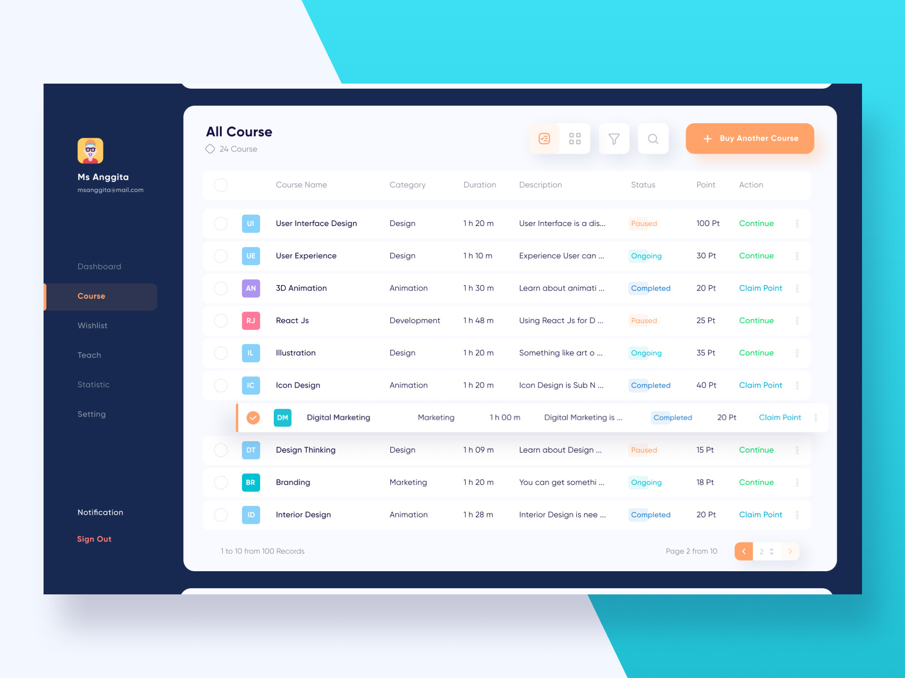

# React + Craft 3 Prototype

The goal of this project is to quickly prototype what a React app would look like with content served from Craft CMS.

## Project Goals

1. See what all the [hoopla's](https://www.youtube.com/watch?v=yICai9wwRl4) about with [React](https://reactjs.org/)
1. Experiment with Crafts [Element API](https://plugins.craftcms.com/element-api) plugin
1. Experiment with capabilities of using Craft as a [headless CMS](https://docs.craftcms.com/v3/dev/headless.html#app)

## Running the Prototype

1. Clone this repo and enter the base project directory with your terminal
2. Install node modules

```script
npm ci
```

3. Install vendor files

```script
cd ./craftcms && composer install
```

4. Point an apache web server to `craftcms/public`
5. Create an new empty database
6. Import the `database.sql` file from `craftcms/` directory
7. Clone the `.env.example` file

```script
cp ./.env.example ./.env
```

8. Open the new `.env` file and enter you local environment information
9. Build the React app

```script
cd .. && npm run build && npm run preview
```

10. Signup for an account, emails are not validated

## Design



Design created by [Dicky Indrayan](https://dribbble.com/dickyindrayan), checkout the design on [dribbble](https://dribbble.com/shots/6905878-Yo-sinau-Course-Dashboard).

## Postmortem
